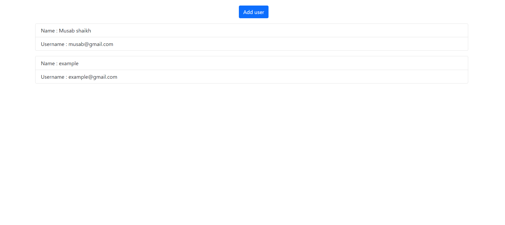
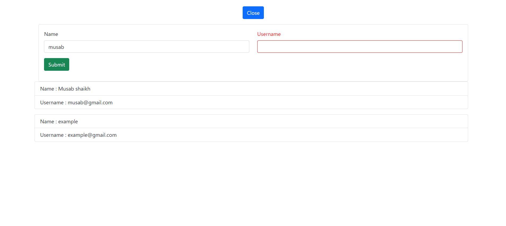
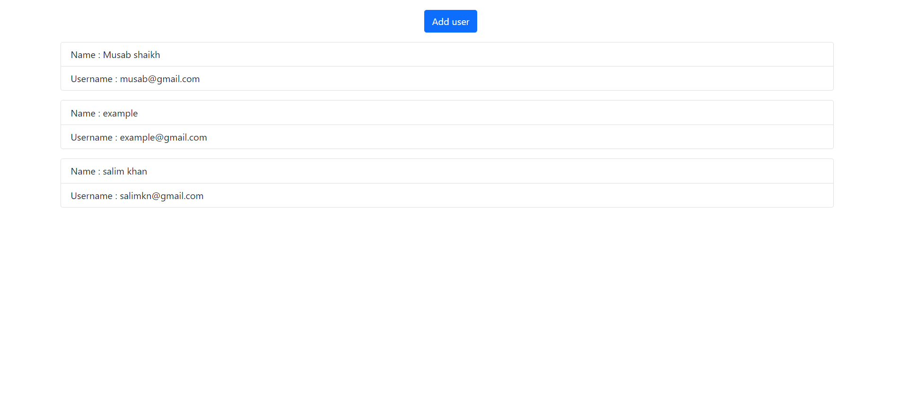
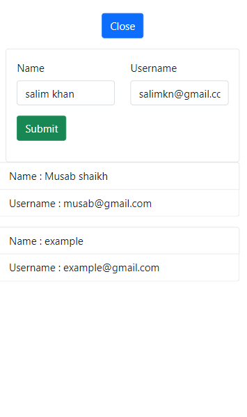

# user-db (User database)

A Web App build using React.js to create user database  

Data that can be added :
1. Name of the user 
2. Username 

Both the fields have custom validation checks like:
1. Both the fields should contain values. (alert warning for any empty field)
2. Email validaton

### Homepage

### Showing custom validation checks

### User added successfully

### Mobile responsive

